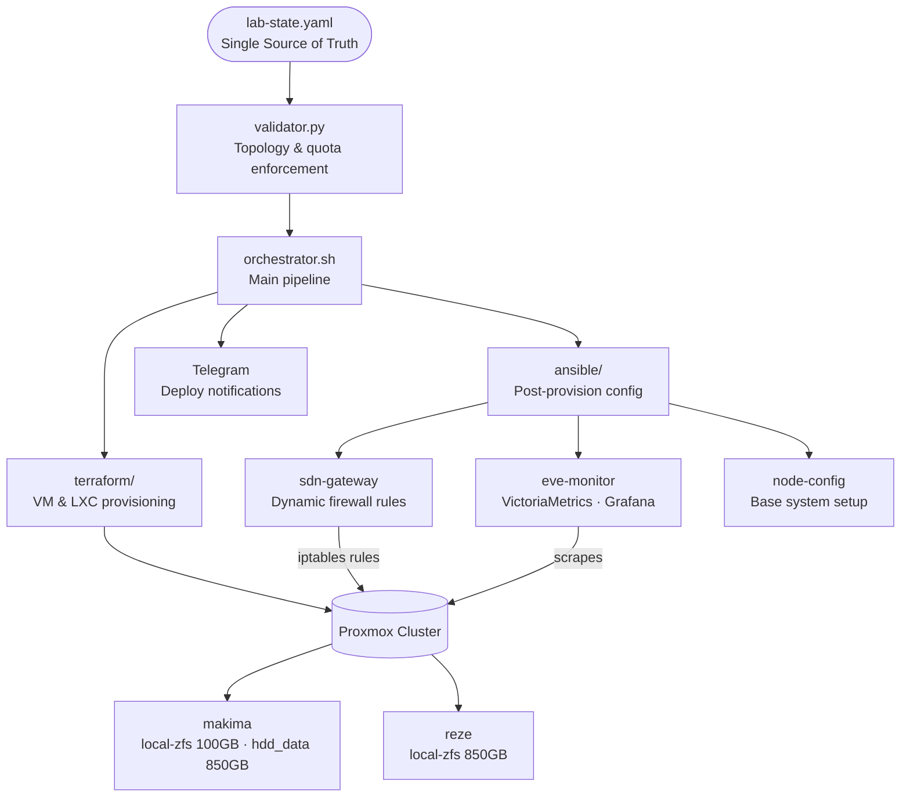

# EVE — Environment Virtualization Engine

A declarative homelab automation pipeline that provisions and manages virtual machines and LXC containers on a Proxmox cluster, driven entirely by a single source-of-truth YAML manifest.

## Architecture



## Physical Topology

| Node | Role | local-zfs | hdd_data |
|------|------|-----------|----------|
| `makima` | Primary | 100GB SSD | 850GB HDD |
| `reze` | Secondary | 850GB HDD | — |

**Cluster limits:** 11 vCPUs · 8192MB RAM total · 2048MB RAM cap for ephemeral resources.

## lab-state.yaml Structure

Each entry under `entornos` describes one resource:

```yaml
entornos:
  - nombre: my-service
    vmid: 110
    tipo: lxc                   # vm | lxc
    os: debian                  # debian | alpine
    estado: presente            # presente | ausente
    nodo_proxmox: makima        # makima | reze
    core: false                 # true = exempt from IP range enforcement
    efimero: false              # true = counts against ephemeral RAM quota
    plantilla: debian-12-std    # required for VMs
    monitor_enabled: true

    recursos:
      cores: 2
      memoria: 512              # MB
      disco: 8                  # GB
      disco_datos:
        storage: hdd_data
        size: 50G

    red:
      ip: 192.168.1.45/24
      gateway: 192.168.1.1

    firewall_externo:
      - puerto: 443
        protocolo: tcp
```

### Storage Assignment Logic

- **Persistent resources** → `local-zfs` on the assigned node
- **Ephemeral resources on `makima`** → `hdd_data` (HDD offload)
- **Ephemeral resources on `reze`** → `local-zfs` (no HDD available)

### Reserved IPs

| Range | Purpose |
|-------|---------|
| `192.168.1.40` | `eve-monitor` — static, mandatory |
| `192.168.1.41–.63` | General lab resources |
| Outside range | `core: true` nodes only |

## Quick Start

### 1. Install dependencies

```bash
chmod +x bootstrap.sh && ./bootstrap.sh
```

Installs: Terraform, Ansible, SOPS, ZeroTier, Age, python3-yaml.

### 2. Configure secrets

```bash
sops --encrypt --age <your-age-public-key> secrets.yaml > secrets.enc.yaml
sops secrets.enc.yaml   # edit in-place
```

### 3. Validate topology

```bash
python3 validator.py
```

Exits `0` on success, `1` on any violation. Runs before Terraform touches the cluster.

**Enforces:** no duplicate names/VMIDs/IPs · RAM/CPU/disk quotas · ephemeral RAM cap ·
`eve-monitor` presence when required · valid storage pools per node · IP range compliance ·
valid OS, protocols, and ports.

### 4. Deploy

```bash
./orchestrator.sh
```

Diffs `lab-state.yaml` against Proxmox state and applies only the delta.

## Project Layout

```text
EVE/
├── lab-state.yaml
├── validator.py
├── orchestrator.sh
├── bootstrap.sh
├── terraform/
│   ├── main.tf
│   ├── variables.tf
│   └── modules/
│       ├── vm/
│       └── lxc/
└── ansible/
    ├── inventory/
    ├── playbooks/
    └── roles/
```

## Supported Systems

| Distribution | vm | lxc |
|--------------|----|-----|
| Debian 12    | ✓  | ✓   |
| Alpine 3.x   | ✓  | ✓   |

## Requirements

- Proxmox VE 8+
- Terraform ≥ 1.6
- Ansible ≥ 2.15
- SOPS ≥ 3.8 + Age
- Python ≥ 3.10 with `pyyaml`
- ZeroTier (out-of-band access)

## Environment Variables

| Variable | Description |
|----------|-------------|
| `PROXMOX_VE_URL` | Proxmox API URL |
| `PROXMOX_VE_API_TOKEN` | API token (preferred auth method) |
| `PROXMOX_VE_USERNAME` | Username (alternative to token) |
| `PROXMOX_VE_PASSWORD` | Password (alternative to token) |
| `TF_VAR_sops_age_key` | Age private key for SOPS decryption |
| `TELEGRAM_BOT_TOKEN` | Telegram bot token for deploy notifications |
| `TELEGRAM_CHAT_ID` | Target chat ID for notifications |

## Monitoring

Once `eve-monitor` is deployed, the stack is available at:

- **Grafana** — `http://192.168.1.40:3000`
- **VictoriaMetrics** — `http://192.168.1.40:8428`

All nodes have Node Exporter installed and are scraped automatically.

## Troubleshooting

**Validator rejects the deployment** — verify the requested resources don't exceed cluster limits (11 vCPUs, 8GB RAM).

**Terraform can't connect to Proxmox** — check that `PROXMOX_VE_*` variables are set and the API token has the required permissions.

**Ansible can't reach the VM via SSH** — wait for cloud-init to finish; verify SSH keys were injected correctly.

**Secrets fail to decrypt** — confirm `SOPS_AGE_KEY_FILE` points to the correct Age key (`~/.config/sops/age/keys.txt`).

## License

MIT
