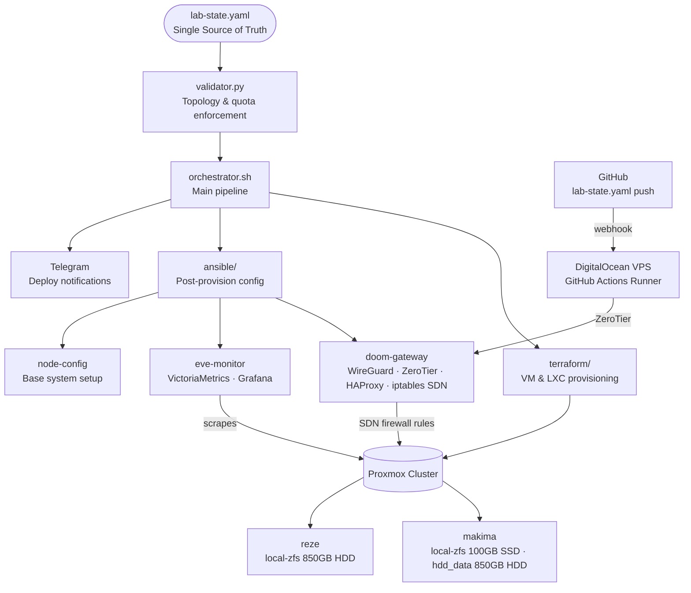

# EVE — Environment Virtualization Engine

A declarative homelab automation pipeline that provisions and manages virtual machines and LXC containers on a Proxmox cluster, driven entirely by a single source-of-truth YAML manifest — with full CI/CD, secrets management, dynamic SDN firewall, and automated monitoring.

## What is EVE

EVE started as a personal challenge: learn Terraform and Ansible not through isolated tutorials, but by building something real that forces them to work together.

The goal was to integrate the entire provisioning lifecycle — infrastructure, configuration, secrets, monitoring, firewall, and CI/CD — while staying within the free tiers of AWS, Cloudflare, and DigitalOcean.

The result is a pipeline where a single YAML file is the only interface. You declare what you want, run the orchestrator, and the cluster converges to that state. The validator enforces cluster topology rules before Terraform touches anything. The janitor cleans up ephemeral resources automatically every 24 hours.

EVE runs on two physical Proxmox nodes with constrained resources (11 vCPUs, 8GB RAM total), which made efficiency a hard requirement rather than a nice-to-have — hence Alpine Linux for lightweight containers, VictoriaMetrics over Prometheus, and storage-aware provisioning that routes ephemeral workloads to HDD pools.

## Architecture



## CI/CD Pipeline

EVE runs entirely on a self-hosted GitHub Actions runner hosted on a DigitalOcean VPS. The VPS connects to the Proxmox cluster over ZeroTier, with all ports closed except ZeroTier traffic — no public attack surface.

Three workflows handle the full lifecycle:

| Workflow | Trigger | Description |
|----------|---------|-------------|
| `eve-sanity-check` | Push to `main` | Validates toolchain, Age identity, ZeroTier connectivity, and `lab-state.yaml` contract |
| `eve-deploy` | Manual (`workflow_dispatch`) | Runs the full pipeline: validate → firewall → infra → config |
| `eve-janitor` | Daily cron + manual | Destroys ephemeral resources; `full-lab` mode requires typing `DESTROY` to confirm |

### Deploy Flow

```
Local machine  
│  
├─ edit lab-state.yaml  
└─ git push → main  
│  
▼  
eve-sanity-check (automatic)  
Validates contract & environment  
│  
▼ (if passing)  
SSH into VPS → git pull  
(updates runner workspace with latest lab-state.yaml)  
│  
▼  
eve-deploy (manual trigger)  
│  
┌───────┴────────┐  
│ │  
--plan --apply  
(read-only) validate → firewall  
→ infra → config
```

> **Note:** The `git pull` on the VPS is currently a manual step. A natural next improvement would be a webhook or a lightweight watcher that triggers the pull automatically on push to `main`.

### Janitor

Ephemeral resources (`efimero: true`) are automatically destroyed every 24 hours by the janitor cron. Resources marked `core: true` are never touched. For a full lab wipe, trigger manually with `full-lab` scope and confirm with `DESTROY`.

### Secrets

Secrets are encrypted at rest with SOPS + Age and stored as `secrets.enc.yaml` in the repository. The runner decrypts them at runtime using an Age key stored outside the repo at `~/.config/sops/age/keys.txt`.

## Access Layer

Remote access to the cluster is handled through two complementary methods, with all inbound ports on the DigitalOcean VPS closed except ZeroTier traffic.

### ZeroTier (Primary)

ZeroTier provides an encrypted overlay network connecting the VPS runner, `doom-gateway`, and both Proxmox nodes. This is the primary out-of-band access path — if the cluster is unreachable over the LAN, ZeroTier is the fallback.

### WireGuard (Secondary)

A manually configured WireGuard VPN (`wg0`) on `doom-gateway` provides an alternative access path. Used for direct LAN access when ZeroTier is unavailable or for lower-latency connections from trusted devices.

### Previous Setup — Cloudflare Zero Trust

The cluster was previously exposed via a Cloudflare Zero Trust tunnel at `eve.hackedagain.lol`. The tunnel ran on the DigitalOcean VPS and connected directly to `doom-gateway` via ZeroTier, providing authenticated HTTPS access to internal services without opening any inbound ports.

```
Browser → Cloudflare Edge → CF Tunnel (VPS) → ZeroTier → doom-gateway → Proxmox cluster
```

The domain is currently inactive (not renewed). The Zero Trust application, tunnel, and DNS records remain configured in Cloudflare — repointing to a new domain requires updating the DNS record and tunnel target only. All infrastructure documentation for this setup is preserved internally.

### Network Summary

| Method | Status | Use case |
|--------|--------|----------|
| ZeroTier | ✅ Active | Primary remote access, CI/CD runner connectivity |
| WireGuard | ✅ Active | Secondary access, trusted devices |
| Cloudflare Zero Trust | ⚠️ Domain inactive | Previously: authenticated public access to internal services |

## lab-state.yaml Structure

Every resource in the cluster is declared as an entry under `entornos`. The validator enforces all rules before Terraform runs.

```yaml
entornos:
  - nombre: my-service       # Unique name — used as Terraform resource key
    vmid: 110                # Unique Proxmox VM/CT ID
    tipo: lxc                # vm | lxc | gateway | fisico
    os: debian               # debian | alpine (LXC only)
    estado: presente         # presente | ausente — desired state
    nodo_proxmox: makima     # makima | reze
    core: false              # true = exempt from quota enforcement and janitor
    efimero: false           # true = counts against ephemeral RAM quota;
                             #        routed to hdd_data on makima
    monitor_enabled: true    # true = Node Exporter installed and scraped

    recursos:
      cores: 2
      memoria: 512           # MB
      disco: 8               # GB
      disco_datos:           # Optional second disk
        storage: hdd_data
        size: 50G
        mp: /var/lib/data    # Mount point inside the container

    red:
      ip: 192.168.1.45/24
      gateway: 192.168.1.1

    firewall_externo:        # Ports forwarded by doom-gateway SDN firewall
      - puerto: 443
        protocolo: tcp
        descripcion: "HTTPS"
```

### Storage Assignment

Storage pool is determined automatically from two fields — `efimero` and `nodo_proxmox`:

| Condition | Assigned pool |
|-----------|--------------|
| `efimero: true` on `makima` | `hdd_data` (HDD offload) |
| Any other combination | `local-zfs` |

`reze` has no `hdd_data` pool — the validator rejects any resource that requests it there.

### Reserved IPs

| Range | Purpose |
|-------|---------|
| `192.168.1.40` | `eve-monitor` — static, mandatory |
| `192.168.1.41–.63` | General lab resources |
| Outside range | `core: true` nodes only |

### Validator Enforcement

Before every deploy, `validator.py` checks:

- No duplicate names, VMIDs, or IPs
- RAM, CPU, and disk quotas not exceeded
- Ephemeral RAM cap respected (2048MB)
- `eve-monitor` present when any resource has `monitor_enabled: true`
- Valid storage pools per node
- IP range compliance
- Valid OS, protocols, and port numbers
- Minimum disk size per OS template

## Quick Start

### Prerequisites

- Proxmox VE cluster with two nodes
- A Linux machine as command station (Debian/Ubuntu recommended)
- A DigitalOcean VPS (or any VPS) registered as a GitHub Actions self-hosted runner
- ZeroTier network connecting VPS and Proxmox nodes
- An Age keypair for SOPS secrets encryption

### 1. Prepare the command station

```bash
git clone https://github.com/<your-user>/EVE.git
cd EVE
chmod +x bootstrap.sh
./bootstrap.sh
```

`bootstrap.sh` installs Terraform, Ansible, SOPS, and ZeroTier, then prompts for your Age private key. Run `source ~/.bashrc` after it completes.

### 2. Configure secrets

```bash
# Edit the encrypted secrets file
sops secrets.enc.yaml
```

Required keys:

| Key | Description |
|-----|-------------|
| `PM_API_URL` | Proxmox API endpoint |
| `PM_API_TOKEN_ID` | Proxmox API token ID |
| `PM_API_TOKEN_SECRET` | Proxmox API token secret |
| `AWS_ACCESS_KEY_ID` | S3 backend credentials |
| `AWS_SECRET_ACCESS_KEY` | S3 backend credentials |
| `AWS_REGION` | S3 bucket region |
| `TELEGRAM_BOT_TOKEN` | Telegram notifications |
| `TELEGRAM_CHAT_ID` | Telegram chat target |
| `grafana_admin_password` | Grafana admin password |

### 3. Declare your infrastructure

Edit `lab-state.yaml` and set `estado: presente` on the resources you want deployed. See [lab-state.yaml Structure](#lab-state.yaml-structure) for the full schema.

### 4. Deploy

```bash
# Dry run — shows what Terraform will create
./orchestrator.sh --plan

# Apply — full pipeline: validate → firewall → infra → config
./orchestrator.sh --apply
```

> **Note:** On the VPS runner, run `git pull` before triggering `eve-deploy` from GitHub Actions to ensure the runner has the latest `lab-state.yaml`.

### 5. Verify

```bash
# Run the validator standalone
python3 validator.py

# Check GitHub Actions for sanity check status
# Notifications are sent to Telegram on every deploy
```

## Project Layout

```
EVE/  
├── lab-state.yaml # Single source of truth — the only file you edit  
├── secrets.enc.yaml # SOPS-encrypted secrets (Age)  
├── orchestrator.sh # Main pipeline entrypoint  
├── validator.py # Contract enforcement before any deploy  
├── bootstrap.sh # Command station setup from scratch  
│  
├── terraform/  
│ ├── main.tf # VM and LXC resource definitions  
│ ├── vars.tf # Input variables  
│ ├── backend.tf # S3 remote state configuration  
│ ├── provider.tf # Proxmox and random providers  
│ └── .terraform.lock.hcl # Provider version lock  
│  
├── ansible/  
│ ├── node-config/  
│ │ └── setup_base.yml # Base system config for all VMs and LXCs  
│ ├── sdn-gateway/  
│ │ ├── deploy-firewall.yml # Generates and applies SDN firewall rules  
│ │ ├── cleanup-firewall.yml# Purges dynamic rules, preserves core nodes  
│ │ └── templates/  
│ │ └── eve-firewall.j2 # iptables script — rendered from lab-state.yaml  
│ └── monitor/  
│ ├── setup_monitor.yml # Installs VictoriaMetrics + Grafana  
│ └── templates/  
│ ├── scrape.yml.j2 # VictoriaMetrics scrape config  
│ ├── victoria-metrics-opts.j2 # Service options  
│ └── dashboard-provider.yml.j2  
│  
└── .github/  
└── workflows/  
├── eve-sanity-check.yml # Runs on every push to main  
├── eve-deploy.yml # Manual deploy trigger  
└── eve-janitor.yml # Daily ephemeral cleanup
```

## Monitoring

Monitoring is optional and controlled by two fields in `lab-state.yaml`:

- `eve-monitor` must have `estado: presente` to activate the stack
- Individual resources opt in with `monitor_enabled: true`

The validator rejects any configuration where `monitor_enabled: true` exists on a resource but `eve-monitor` is absent.

### Stack

| Component | Role |
|-----------|------|
| **Node Exporter** | Installed on each monitored VM/LXC — exposes CPU, memory, disk, and network metrics |
| **VictoriaMetrics** | Lightweight Prometheus-compatible TSDB — scrapes all Node Exporters |
| **Grafana** | Visualization — pre-provisioned with a Node Exporter dashboard |

All three are deployed automatically by `ansible/monitor/setup_monitor.yml` when `eve-monitor` is present.

### Access

Grafana is available at `http://192.168.1.40:3000` from within the ZeroTier or WireGuard network. The admin password is stored in `secrets.enc.yaml` under `grafana_admin_password`.

## Troubleshooting

### Proxmox API token — 403 on apply

The Proxmox API token requires explicit privilege separation disabled. In the Proxmox UI:

> Datacenter → Permissions → API Tokens → uncheck **Privilege Separation**

Without this, Terraform receives 403 errors even with the correct token and permissions assigned.

### Terraform clone fails — template not found

Verify the template name in `lab-state.yaml` matches exactly the name shown in Proxmox:

```bash
# On the Proxmox node
qm list | grep template
```

Template names are case-sensitive and must include no trailing whitespace.

### Ansible — Python not found on Alpine LXC

The `setup_base.yml` bootstrap task installs Python via `raw` before gathering facts. If it still fails, verify the Alpine template has network access at provision time:

```bash
# From doom-gateway
ping 192.168.1.<lxc-ip>
```

If unreachable, the LXC may have been provisioned before `eve-firewall.sh` was applied. Re-run `deploy-firewall.yml` and retry.

### ZeroTier — runner can't reach Proxmox nodes

```bash
# On the VPS
zerotier-cli listpeers
zerotier-cli listnetworks

# Verify doom-gateway is authorized at
# https://my.zerotier.com
```

Ensure `doom-gateway` has IP forwarding enabled and `iptables` is not dropping ZeroTier-sourced packets.

### SOPS decryption fails on runner

Verify the Age key is present at the expected path on the VPS:

```bash
ls -la ~/.config/sops/age/keys.txt
echo $SOPS_AGE_KEY_FILE
```

If the environment variable is missing, add it to `~/.bashrc` and re-source:

```bash
export SOPS_AGE_KEY_FILE="$HOME/.config/sops/age/keys.txt"
```

## Physical Topology

| Node | Role | CPU | RAM | Storage |
|------|------|-----|-----|---------|
| `makima` | Proxmox primary | 6 vCPU | 6GB | 100GB SSD (`local-zfs`) · 850GB HDD (`hdd_data`) |
| `reze` | Proxmox secondary | 5 vCPU | 2GB | 850GB HDD (`local-zfs`) |
| `doom-gateway` | Raspberry Pi 4 | 4 core | 4GB | 32GB SD |

## License

MIT — see [LICENSE](LICENSE).

