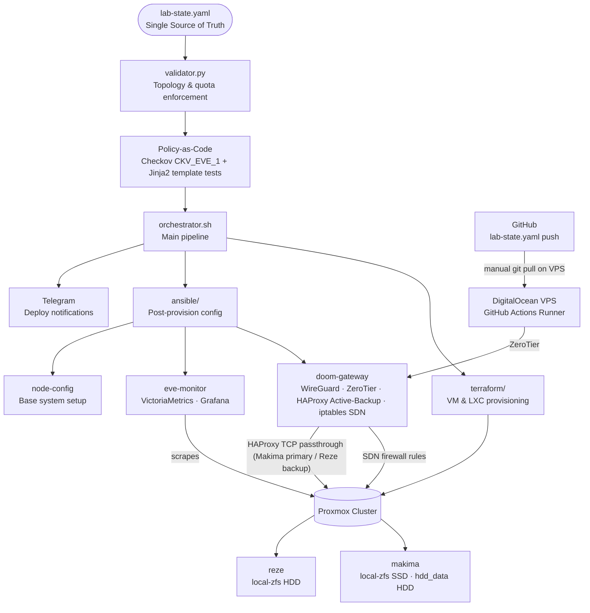

# EVE — Environment Virtualization Engine

[](#license)
[]()
[]()
[]()
<!-- Once the repo is public and the workflow has run at least once, replace <your-user> below to enable a live CI badge:
[](https://github.com/<your-user>/EVE/actions) -->

A declarative homelab automation pipeline that provisions and manages virtual machines and LXC containers on a Proxmox cluster, driven entirely by a single source-of-truth YAML manifest — with full CI/CD, encrypted secrets, a dynamic SDN firewall, policy-as-code guardrails, and automated monitoring.

## Highlights

- **Single source of truth**: one YAML file (`lab-state.yaml`) drives Terraform, Ansible, the firewall, and the monitoring stack — no static inventories anywhere in the pipeline.
- **Security-first secrets**: all credentials encrypted at rest with SOPS + Age; zero plaintext secrets ever committed.
- **Centralized SDN firewall**: perimeter firewall rules on a Raspberry Pi gateway, generated dynamically from the same contract that provisions infrastructure — no per-VM manual `iptables` editing.
- **Policy-as-code guardrail**: a custom Checkov check blocks any regression toward per-host firewalling before it ever reaches Proxmox.
- **Zero Trust access history**: previously exposed via a Cloudflare Zero Trust tunnel with path-scoped bypass policies for WebSocket console traffic — full design preserved even though the demo domain is currently inactive.
- **Resource-aware by necessity**: built and stress-tested on a genuinely constrained cluster, forcing real engineering trade-offs (Alpine over Debian where possible, VictoriaMetrics over Prometheus, HDD-offload for ephemeral workloads).
- **Validated, not just built**: drift-resilience and firewall-isolation behavior were verified with real network evidence (`nmap`, `iptables`, `tcpdump`), not just code review.

## What is EVE

EVE started as a personal challenge: learn Terraform and Ansible not through isolated tutorials, but by building something real that forces them to work together.

The goal was to integrate the entire provisioning lifecycle — infrastructure, configuration, secrets, firewall, monitoring, and CI/CD — while staying within the free tiers of AWS, Cloudflare, and DigitalOcean.

The result is a pipeline where a single YAML file is the only interface. You declare what you want, run the orchestrator, and the cluster converges to that state. The validator enforces cluster topology and resource-quota rules before Terraform touches anything. The janitor cleans up ephemeral resources automatically every 24 hours.

EVE runs on two physical Proxmox nodes with constrained resources, which made efficiency a hard requirement rather than a nice-to-have — hence Alpine Linux for lightweight containers, VictoriaMetrics over Prometheus, and storage-aware provisioning that routes ephemeral workloads to HDD pools.

## Architecture



## CI/CD Pipeline

EVE runs entirely on a self-hosted GitHub Actions runner hosted on a DigitalOcean VPS. The VPS connects to the Proxmox cluster over ZeroTier, with all ports closed except ZeroTier traffic — no public attack surface.

Three workflows handle the full lifecycle:

| Workflow | Trigger | Description |
|----------|---------|-------------|
| `eve-sanity-check` | Push to `main` (automatic) | Runs the unit test suite, validates toolchain, Age identity, ZeroTier connectivity, and `lab-state.yaml` contract |
| `eve-deploy` | Manual (`workflow_dispatch`) | Runs either a Terraform-only `--plan` or the full pipeline: validate → policy scan → firewall → infra → config |
| `eve-janitor` | Daily cron (ephemeral only) + manual (`workflow_dispatch`) | Manual runs can target ephemeral-only or `full-lab` cleanup; `full-lab` requires typing `DESTROY` to confirm |

### Deploy Flow

The pipeline has **no webhook or automatic polling** — pulling changes onto the runner is a deliberate manual step, kept that way so nothing touches the physical cluster without a human explicitly deciding it should:

```
Local machine
│
├─ edit lab-state.yaml
└─ git push → main
│
▼
eve-sanity-check (automatic)
Unit tests → contract validation → environment checks
│
▼ (if passing, manually:)
SSH into VPS → git pull
(updates runner workspace with the latest lab-state.yaml)
│
▼ (manually trigger via workflow_dispatch, as needed:)
┌──────────────┬──────────────────┬───────────────────────┐
│              │                  │                       │
eve-janitor    validator-only     eve-deploy --plan       eve-deploy --apply
(ephemeral or  (sanity re-check)  (Terraform plan only,    (full pipeline:
 full-lab)                         read-only)               validate → policy
                                                             scan → firewall →
                                                             infra → config)
```

Independently of any push, `eve-janitor` also runs on a **daily cron**, silently destroying every resource marked `efimero: true` regardless of whether anyone pushed or deployed that day — resources marked `core: true` are always exempt.

### Secrets

Secrets are encrypted at rest with SOPS + Age and stored as `secrets.enc.yaml` in the repository. The runner decrypts them at runtime using an Age key stored outside the repo, at `~/.config/sops/age/keys.txt`. Secrets are explicitly masked (`::add-mask::`) before being written to any CI environment variable, so they never appear in workflow logs — even with debug logging enabled.

## Testing & Policy-as-Code

Before any infrastructure change reaches Proxmox, two independent safety nets run in CI:

| Layer | Tool | What it checks |
|-------|------|-----------------|
| **Unit tests** | `pytest` (`tests/test_validator.py`) | Contract validation logic — duplicate detection, quota math, IP range rules |
| **Firewall template tests** | `pytest` + Jinja2 (`tests/test_firewall_template.py`) | Renders `eve-firewall.j2` directly (no Ansible, no Docker) and asserts every `firewall_externo` port generates its exact `ACCEPT` rule, undeclared ports never do, and the default-`DROP` catch-all always comes last |
| **Policy scan** | Checkov custom check `CKV_EVE_1` | Fails the pipeline if any `proxmox_lxc`/`proxmox_vm_qemu` resource ever enables per-host firewalling — the real regression to guard against, since EVE's firewall model is intentionally centralized on the gateway |

Both test layers run inside a project-local virtual environment (`ensure_venv()` in `orchestrator.sh`), avoiding conflicts with system Python on modern Debian/Ubuntu/Fedora runners.

## Access Layer

Remote access to the cluster is handled through two complementary methods, with all inbound ports on the DigitalOcean VPS closed except ZeroTier traffic.

### ZeroTier (Primary)

ZeroTier provides an encrypted overlay network connecting the VPS runner, `doom-gateway`, and both Proxmox nodes. This is the primary access path for the GitHub Actions runner and for day-to-day administration.

### WireGuard (Secondary)

A manually configured WireGuard VPN (`wg0`) on `doom-gateway` provides a backup SSH-only path directly to the gateway — used if ZeroTier is unavailable. It is intentionally not wired into the GUI/HAProxy path.

### HAProxy — Active-Backup

`doom-gateway` runs HAProxy in pure TCP (L4 passthrough) mode, so Proxmox's native TLS is never terminated early. It load-balances the Proxmox GUI/API between the two cluster nodes in an active-backup configuration — `makima` primary, `reze` as automatic failover — so the cluster's web interface stays reachable even if the primary node goes down.

### Previous Setup — Cloudflare Zero Trust

The cluster was previously exposed via a Cloudflare Zero Trust tunnel at `eve.<domain>`. The tunnel ran on the DigitalOcean VPS and connected directly to `doom-gateway` via ZeroTier, providing authenticated HTTPS access to internal services without opening any inbound ports. A path-scoped bypass policy (`/api2`) allowed Proxmox's console WebSocket traffic through without breaking Cloudflare Access authentication for the rest of the app — Proxmox's own login remained the real gate for that path.

```
Browser → Cloudflare Edge → CF Tunnel (VPS) → ZeroTier → doom-gateway → Proxmox cluster
```

The domain is currently inactive (not renewed). The Zero Trust application, tunnel, and DNS-adjacent configuration remain intact on Cloudflare's side — repointing to a new domain only requires updating the hostname and tunnel target. Full internal documentation for this layer, including the debugging history, is preserved in [`docs/engineering-log.md`](docs/engineering-log.md#13-perimeter-access-layer-cloudflare--zerotier--haproxy).

### Network Summary

| Method | Status | Use case |
|--------|--------|----------|
| ZeroTier | ✅ Active | Primary remote access, CI/CD runner connectivity |
| WireGuard | ✅ Active | Secondary access, SSH-only backup to the gateway |
| HAProxy Active-Backup | ✅ Active | Load-balanced access to the Proxmox GUI/API |
| Cloudflare Zero Trust | ⚠️ Domain inactive | Previously: authenticated public access to internal services |

## lab-state.yaml Structure

Every resource in the cluster is declared as an entry under `entornos`. The validator enforces all rules before Terraform runs.

```yaml
entornos:
  - nombre: my-service       # Unique name — used as Terraform resource key
    vmid: 110                # Unique Proxmox VM/CT ID
    tipo: lxc                # vm | lxc | gateway | fisico
    os: debian               # debian | alpine (LXC only)
    estado: presente         # presente | ausente — desired state
    nodo_proxmox: makima     # makima | reze
    core: false              # true = exempt from quota enforcement and janitor
    efimero: false           # true = counts against ephemeral RAM quota;
                             #        routed to hdd_data on makima
    monitor_enabled: true    # true = Node Exporter installed and scraped

    recursos:
      cores: 2
      memoria: 512           # MB
      disco: 8               # GB
      disco_datos:           # Optional second disk
        storage: hdd_data
        size: 50G
        mp: /var/lib/data    # Mount point inside the container

    red:
      ip: 192.168.1.45/24
      gateway: 192.168.1.1

    firewall_externo:        # Ports forwarded by doom-gateway SDN firewall
      - puerto: 443
        protocolo: tcp
        descripcion: "HTTPS"
```

> **Note:** any VM/LXC that relies on Terraform's `remote-exec` provisioner to confirm SSH readiness must declare `puerto: 22` (`tcp`) in `firewall_externo`. The SDN firewall on `doom-gateway` is deny-by-default for all forwarded traffic into the LAN — including from the command station or CI runner provisioning the resource. There is no implicit bypass for the tooling itself.

> **Note:** `os:` and `plantilla:` work differently on purpose. `plantilla:` is a direct passthrough — `main.tf` sends the string straight to Proxmox as `clone = each.value.plantilla`, so adding a new VM golden template only requires creating it in Proxmox and referencing its exact name in `lab-state.yaml`, no code changes. `os:` is a logical label (`alpine`/`debian`), not a literal filename — `main.tf` translates it into the real container tarball path (`ostemplate`) via a ternary, and `validator.py`'s `lxc_templates` dict maps the same label to its tarball and minimum disk size. That indirection means adding a third LXC OS option does require editing the ternary in `main.tf`, unlike VM templates.


### Storage Assignment

Storage pool is determined automatically from two fields — `efimero` and `nodo_proxmox`:

| Condition | Assigned pool |
|-----------|--------------|
| `efimero: true` on `makima` | `hdd_data` (HDD offload) |
| Any other combination | `local-zfs` |

`reze` has no `hdd_data` pool — the validator rejects any resource that requests it there.

### Reserved IPs

| Range | Purpose |
|-------|---------|
| `192.168.1.40` | `eve-monitor` — static, mandatory |
| `192.168.1.41–.63` | General lab resources |
| Outside range | `core: true` nodes only |

### Validator Enforcement

Before every deploy, `validator.py` checks:

- No duplicate names, VMIDs, or IPs
- RAM, CPU, and disk quotas not exceeded, per node and per storage pool
- Ephemeral RAM cap respected
- `eve-monitor` present when any resource has `monitor_enabled: true`
- Valid storage pools per node
- IP range compliance
- Valid OS, protocols, and port numbers
- Minimum disk size per OS template

## Quick Start

### Prerequisites

- Proxmox VE cluster with two nodes
- A Linux machine as command station (Debian/Ubuntu recommended)
- A DigitalOcean VPS (or any VPS) registered as a GitHub Actions self-hosted runner
- ZeroTier network connecting VPS and Proxmox nodes
- An Age keypair for SOPS secrets encryption

### 1. Prepare the command station

```bash
git clone https://github.com/<your-user>/EVE.git
cd EVE
chmod +x bootstrap.sh
./bootstrap.sh
```

`bootstrap.sh` installs Terraform, Ansible, SOPS, and ZeroTier, then prompts for your Age private key. Run `source ~/.bashrc` after it completes.

### 2. Configure secrets

```bash
# Edit the encrypted secrets file
sops secrets.enc.yaml
```

Required keys:

| Key | Description |
|-----|-------------|
| `pm_api_url` | Proxmox API endpoint |
| `pm_api_token_id` | Proxmox API token ID |
| `pm_api_token_secret` | Proxmox API token secret |
| `aws_access_key_id` | S3 backend credentials |
| `aws_secret_access_key` | S3 backend credentials |
| `aws_region` | S3 bucket region |
| `telegram_bot_token` | Telegram notifications |
| `telegram_chat_id` | Telegram chat target |
| `grafana_admin_password` | Grafana admin password |

> Note: these are the exact keys as they appear in `secrets.enc.yaml`. `orchestrator.sh` uppercases them automatically (`k.upper()`) when exporting them as environment variables at runtime — you never need to type them in uppercase yourself.

### 3. Declare your infrastructure

Edit `lab-state.yaml` and set `estado: presente` on the resources you want deployed. See [lab-state.yaml Structure](#lab-stateyaml-structure) for the full schema.

### 4. Deploy

```bash
# Dry run — shows what Terraform will create
./orchestrator.sh --plan

# Apply — full pipeline: validate → policy scan → firewall → infra → config (default action)
./orchestrator.sh --apply
```

> **Note:** On the VPS runner, run `git pull` manually before triggering `eve-deploy` from GitHub Actions to ensure the runner has the latest `lab-state.yaml` — there is no webhook or automatic sync between GitHub and the runner's local checkout.

### 5. Verify

```bash
# Run the validator standalone
python3 validator.py

# Run the full test suite standalone
pytest tests/ -v

# Check GitHub Actions for sanity check status
# Notifications are sent to Telegram on every deploy
```

## Project Layout

```
EVE/
├── lab-state.yaml              # Single source of truth — the only file you edit
├── secrets.enc.yaml            # SOPS-encrypted secrets (Age)
├── orchestrator.sh             # Main pipeline entrypoint
├── validator.py                # Contract enforcement before any deploy
├── bootstrap.sh                # Command station setup from scratch
│
├── docs/
│   └── engineering-log.md      # Deep-dive: incidents, bugs, fixes, stress-test methodology
│
├── tests/
│   ├── test_validator.py       # Unit tests for validator.py
│   └── test_firewall_template.py # Jinja2 render tests for the SDN firewall
│
├── custom_checks/
│   └── CKV_EVE_1_no_host_firewall.py  # Checkov policy-as-code guardrail
│
├── terraform/
│   ├── main.tf                 # VM and LXC resource definitions
│   ├── vars.tf                 # Input variables
│   ├── backend.tf              # S3 remote state configuration (native locking)
│   ├── provider.tf             # Proxmox and random providers
│   └── .terraform.lock.hcl     # Provider version lock
│
├── ansible/
│   ├── node-config/
│   │   └── setup_base.yml      # Base system config for all VMs and LXCs
│   ├── sdn-gateway/
│   │   ├── deploy-firewall.yml # Generates and applies SDN firewall rules
│   │   ├── cleanup-firewall.yml# Purges dynamic rules, preserves core nodes
│   │   └── templates/
│   │       └── eve-firewall.j2 # iptables script — rendered from lab-state.yaml
│   └── monitor/
│       ├── setup_monitor.yml   # Installs VictoriaMetrics + Grafana
│       └── templates/
│           ├── scrape.yml.j2
│           ├── victoria-metrics-opts.j2
│           └── dashboard-provider.yml.j2
│
└── .github/
    └── workflows/
        ├── eve-sanity-check.yml # Runs on every push to main
        ├── eve-deploy.yml       # Manual deploy trigger (plan or apply)
        └── eve-janitor.yml      # Daily ephemeral cleanup + manual trigger
```

## Monitoring

Monitoring is optional and controlled by two fields in `lab-state.yaml`:

- `eve-monitor` must have `estado: presente` to activate the stack
- Individual resources opt in with `monitor_enabled: true`

The validator rejects any configuration where `monitor_enabled: true` exists on a resource but `eve-monitor` is absent.

### Stack

| Component | Role |
|-----------|------|
| **Node Exporter** | Installed on each monitored VM/LXC — exposes CPU, memory, disk, and network metrics |
| **VictoriaMetrics** | Lightweight Prometheus-compatible TSDB — scrapes all Node Exporters, auto-discovered from `lab-state.yaml` |
| **Grafana** | Visualization — pre-provisioned with a Node Exporter dashboard |

All three are deployed automatically by `ansible/monitor/setup_monitor.yml` when `eve-monitor` is present.

### Access

Grafana is available at `http://192.168.1.40:3000` from within the ZeroTier or WireGuard network. The admin password is stored in `secrets.enc.yaml` under `grafana_admin_password`.

## Troubleshooting

### Proxmox API token — 403 on apply

The Proxmox API token requires explicit privilege separation disabled. In the Proxmox UI:

> Datacenter → Permissions → API Tokens → uncheck **Privilege Separation**

Without this, Terraform receives 403 errors even with the correct token and permissions assigned.

### Terraform clone fails — template not found

Verify the template name in `lab-state.yaml` matches exactly the name shown in Proxmox:

```bash
# On the Proxmox node
qm list | grep template
```

Template names are case-sensitive and must include no trailing whitespace.

### Ansible — Python not found on Alpine LXC

The `setup_base.yml` bootstrap task installs Python via `raw` before gathering facts, with retries. If it still fails, verify the Alpine template has network access at provision time:

```bash
# From doom-gateway
ping 192.168.1.<lxc-ip>
```

If unreachable, the LXC may have been provisioned before `eve-firewall.sh` was applied. Re-run `deploy-firewall.yml` and retry.

### ZeroTier — runner can't reach Proxmox nodes

```bash
# On the VPS
zerotier-cli listpeers
zerotier-cli listnetworks

# Verify doom-gateway is authorized at
# https://my.zerotier.com
```

Ensure `doom-gateway` has IP forwarding enabled and that its `FORWARD` chain explicitly accepts new outbound connections from the LAN — a missing rule here can silently block all outbound traffic while leaving ICMP working, which is easy to misdiagnose as a DNS or MTU issue.

### SOPS decryption fails on runner

Verify the Age key is present at the expected path on the VPS:

```bash
ls -la ~/.config/sops/age/keys.txt
echo $SOPS_AGE_KEY_FILE
```

If the environment variable is missing, add it to `~/.bashrc` and re-source:

```bash
export SOPS_AGE_KEY_FILE="$HOME/.config/sops/age/keys.txt"
```

## Engineering Deep Dive

This README covers the system as it stands. For the full debugging history — including a 3-day cascading-failure investigation while rebuilding the lab from scratch, a CI-vs-local network topology mismatch, a silent firewall bug that blocked all outbound traffic, and the stress-testing methodology used to validate the contract validator — see [`docs/engineering-log.md`](docs/engineering-log.md).

## Physical Topology

| Node | Hardware | Role | Storage |
|------|----------|------|---------|
| `reze` (Dell) | Intel i7, 8 cores @ 2.10GHz, 8GB RAM | Proxmox node, HAProxy failover target | 1TB HDD (`local-zfs`) |
| `makima` (Lenovo) | Intel i3, 4 cores @ 1.20GHz, 8GB RAM | Proxmox node, HAProxy primary target | 128GB NVMe (`local-zfs`) + 1TB HDD (`hdd_data`) |
| `doom-gateway` | Raspberry Pi 4 Model B, 4 cores @ 1.80GHz, 8GB RAM | Perimeter gateway, quorum QDevice, SDN firewall | 32GB microSD |

## License

MIT
